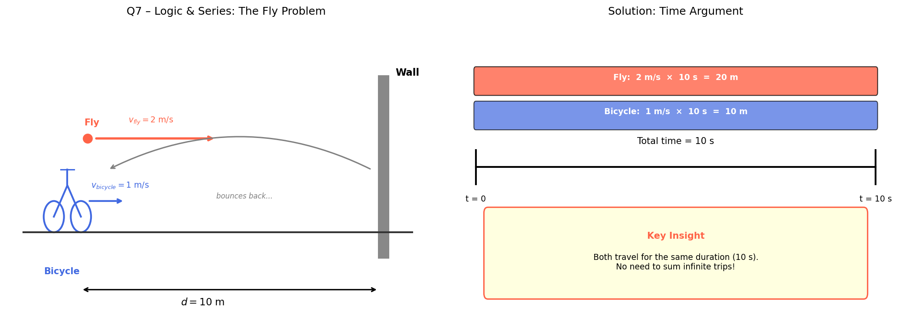

## 7. Logic & Series

A bicycle is 10 meters from a wall and moves towards it at a constant speed of $1\text{ m/s}$. A fly starts from the bicycle's front wheel and flies towards the wall at $2\text{ m/s}$. When it hits the wall, it instantly turns back and flies to the bicycle, and so on. What is the total distance the fly travels before being crushed?

> **Problem**

> Find the total distance traveled by the fly before the bicycle reaches the wall.

> **Idea**
>
> Instead of summing the infinite back-and-forth trips, use a time argument: the fly travels for the same total duration as the bicycle's journey.
>
>

>  
> 

> **Step 1 – Find the time until the bicycle reaches the wall**
>
> $$
> t = \frac{d}{v} = \frac{10\ \text{m}}{1\ \text{m/s}} = 10\ \text{s}
> $$

> **Step 2 – Compute the total distance of the fly**
>
> The fly travels at $2\ \text{m/s}$ for the entire $10\ \text{s}$.
>
> $$
> d_{\text{fly}} = v_{\text{fly}} \times t = 2 \times 10 = 20\ \text{m}
> $$

> **Result**
>
> The fly travels a total distance of $\mathbf{20\ \text{m}}$.

---
