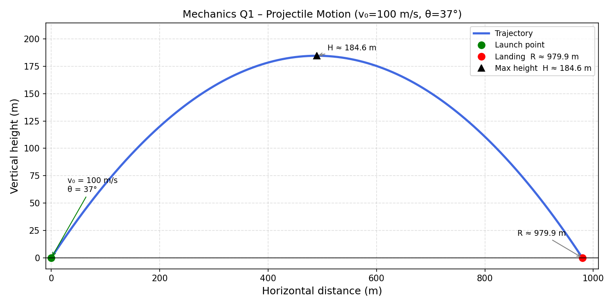

## 1. Projectile Motion

A projectile is fired from the ground with an initial velocity of $100  \text{ m/s}$ at an angle of $37^\circ$ above the horizontal. Assume no air resistance.

> **Problem**
>
> Derive the equations of motion, time of flight, maximum height, and range.

> **Idea**
>
> Decompose the initial velocity into horizontal and vertical components. The horizontal motion is uniform (no acceleration), and the vertical motion is uniformly accelerated by gravity.
>
> $$
> v_{0x} = v_0 \cos\theta, \qquad v_{0y} = v_0 \sin\theta
> $$

---

* Derive the differential equations of motion in the horizontal and vertical directions.

> **Step 1 – Horizontal direction**
>
> No force acts horizontally, so:
>
> $$
> \ddot{x} = 0
> $$

> **Step 2 – Vertical direction**
>
> Gravity acts downward:
>
> $$
> \ddot{y} = -g
> $$

> **Result**
>
> $$
> \ddot{x} = 0, \qquad \ddot{y} = -g
> $$

---

* Determine the time of flight.

> **Step 1 – Integrate vertical equation**
>
> $$
> \dot{y}(t) = v_{0y} - gt = v_0\sin\theta - gt
> $$

> **Step 2 – Integrate again for position**
>
> $$
> y(t) = v_0\sin\theta \cdot t - \frac{1}{2}gt^2
> $$

> **Step 3 – Set $y = 0$ for landing**
>
> $$
> t\left(v_0\sin\theta - \frac{1}{2}gt\right) = 0
> $$

> **Step 4 – Take the non-zero solution**
>
> $$
> t_{\text{flight}} = \frac{2v_0\sin\theta}{g}
> $$

> **Step 5 – Substitute values** ($v_0 = 100$ m/s, $\theta = 37^\circ$, $g = 9.81$ m/s²)
>
> $$
> t_{\text{flight}} = \frac{2 \times 100 \times \sin 37^\circ}{9.81} = \frac{2 \times 100 \times 0.6018}{9.81} \approx 12.27 \text{ s}
> $$

> **Result**
>
> $$
> t_{\text{flight}} \approx 12.27 \text{ s}
> $$

---

* Determine the maximum height.

> **Step 1 – At maximum height, vertical velocity is zero**
>
> $$
> v_0\sin\theta - g t_{\text{top}} = 0 \implies t_{\text{top}} = \frac{v_0\sin\theta}{g}
> $$

> **Step 2 – Substitute into $y(t)$**
>
> $$
> H = v_0\sin\theta \cdot \frac{v_0\sin\theta}{g} - \frac{1}{2}g\left(\frac{v_0\sin\theta}{g}\right)^2
> $$

> **Step 3 – Simplify**
>
> $$
> H = \frac{v_0^2\sin^2\theta}{2g}
> $$

> **Step 4 – Substitute values**
>
> $$
> H = \frac{100^2 \times (0.6018)^2}{2 \times 9.81} \approx \frac{3622}{19.62} \approx 184.6 \text{ m}
> $$

> **Result**
>
> $$
> H \approx 184.6 \text{ m}
> $$

---

* Determine the range.

> **Step 1 – Horizontal position equation**
>
> $$
> x(t) = v_0\cos\theta \cdot t
> $$

> **Step 2 – Substitute $t_{\text{flight}}$**
>
> $$
> R = v_0\cos\theta \cdot \frac{2v_0\sin\theta}{g} = \frac{v_0^2 \sin(2\theta)}{g}
> $$

> **Step 3 – Substitute values** ($\sin 74^\circ \approx 0.9613$)
>
> $$
> R = \frac{100^2 \times 0.9613}{9.81} \approx 980 \text{ m}
> $$

> **Result**
>
> $$
> R \approx 980 \text{ m}
> $$
>
> 

>  
> 

---
