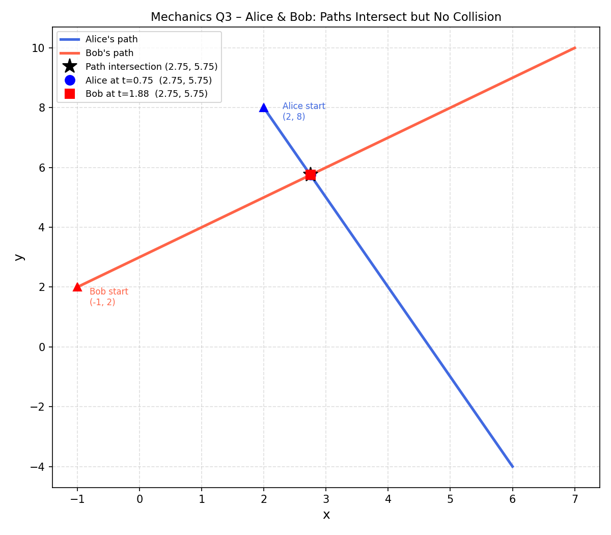

## 3. Path Intersection

Alice is moving along a path described by $A(t) = (2+t, 8-3t)$ and Bob is moving along a path $B(t) = (2t-1, 2t+2)$. Determine if their paths intersect. If yes, determine when and where they will collide. If not, determine the minimum distance between them and when it occurs.

> **Problem**
>
> Determine if the paths intersect, and if so, whether they collide (same place at the same time).

> **Idea**
>
> First check if the paths (curves in space) intersect by solving for $t_A$ and $t_B$ independently. Then check if $t_A = t_B$ for a collision.

> **Step 1 – Set x-coordinates equal**
>
> $$
> 2 + t_A = 2t_B - 1 \implies t_A = 2t_B - 3 \quad (1)
> $$

> **Step 2 – Set y-coordinates equal**
>
> $$
> 8 - 3t_A = 2t_B + 2 \implies 3t_A + 2t_B = 6 \quad (2)
> $$

> **Step 3 – Substitute (1) into (2)**
>
> $$
> 3(2t_B - 3) + 2t_B = 6
> $$
>
> $$
> 6t_B - 9 + 2t_B = 6 \implies 8t_B = 15 \implies t_B = \frac{15}{8}
> $$

> **Step 4 – Find $t_A$**
>
> $$
> t_A = 2 \times \frac{15}{8} - 3 = \frac{30}{8} - 3 = \frac{6}{8} = \frac{3}{4}
> $$

> **Step 5 – Find the intersection point**
>
> Using Alice's position at $t_A = \tfrac{3}{4}$:
>
> $$
> A\!\left(\tfrac{3}{4}\right) = \left(2 + \tfrac{3}{4},\ 8 - \tfrac{9}{4}\right) = \left(\tfrac{11}{4},\ \tfrac{23}{4}\right)
> $$

> **Step 6 – Check for collision**
>
> Since $t_A = \tfrac{3}{4} \neq t_B = \tfrac{15}{8}$, they are not at the same place at the same time.

> **Result**
>
> The **paths intersect** at the point $\left(\dfrac{11}{4},\ \dfrac{23}{4}\right)$, but Alice and Bob are **never there at the same time** — they do **not collide**.
>
> 

>  
> 

---
