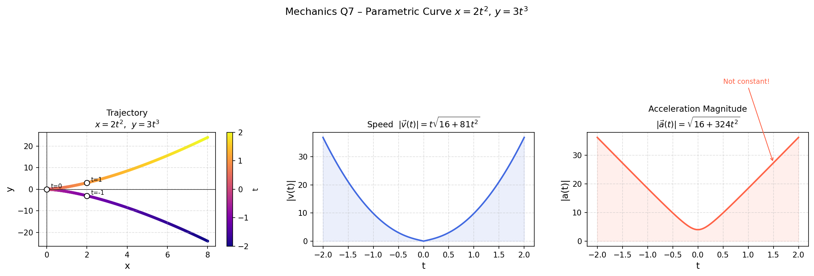

## 7. Elimination of Time and Interpretation of Acceleration

The path equation is given in parametric form:

$$
x(t) = 2t^2, \qquad y(t) = 3t^3
$$

> **Problem**
>
> Eliminate the parameter $t$ to find the trajectory equation, compute the velocity and acceleration vectors (and their magnitudes), and determine if the acceleration is constant.

> **Idea**
>
> Express $t$ from the $x(t)$ equation and substitute it into $y(t)$ to find the geometric path. Then, differentiate the parametric equations with respect to time to find kinematics.

---

* Eliminate the parameter $t$.

> **Step 1 – Solve for $t$ from $x(t)$**
>
> $$
> t^2 = \frac{x}{2} \implies t = \sqrt{\frac{x}{2}} \qquad (t \geq 0)
> $$

> **Step 2 – Substitute into $y(t)$**
>
> $$
> y = 3t^3 = 3\left(\sqrt{\frac{x}{2}}\right)^3 = 3\left(\frac{x}{2}\right)^{3/2} = \frac{3}{2\sqrt{2}}\,x^{3/2}
> $$

> **Result**
>
> $$
> y = \frac{3}{2\sqrt{2}}\,x^{3/2}
> $$
>
> This is a power-law curve (half-power), steeper than a parabola.

---

* Compute $\vec{v}(t)$, $|\vec{v}(t)|$, $\vec{a}(t)$, and $|\vec{a}(t)|$.

> **Step 1 – Velocity**
>
> $$
> \vec{v}(t) = \dot{x}\,\hat{i} + \dot{y}\,\hat{j} = 4t\,\hat{i} + 9t^2\,\hat{j}
> $$
>
> $$
> |\vec{v}(t)| = \sqrt{(4t)^2 + (9t^2)^2} = t\sqrt{16 + 81t^2}
> $$

> **Step 2 – Acceleration**
>
> $$
> \vec{a}(t) = \ddot{x}\,\hat{i} + \ddot{y}\,\hat{j} = 4\,\hat{i} + 18t\,\hat{j}
> $$
>
> $$
> |\vec{a}(t)| = \sqrt{16 + 324t^2}
> $$

> **Result**
>
> $$
> \vec{v}(t) = 4t\,\hat{i} + 9t^2\,\hat{j}, \qquad |\vec{v}(t)| = t\sqrt{16 + 81t^2}
> $$
>
> $$
> \vec{a}(t) = 4\,\hat{i} + 18t\,\hat{j}, \qquad |\vec{a}(t)| = \sqrt{16 + 324t^2}
> $$

---

* Is the acceleration constant?

> **Result**
>
> **No.** The $y$-component of acceleration is $18t$, which depends on time. Only the $x$-component ($4 \text{ m/s}^2$) is constant. Therefore, $\vec{a}(t)$ changes both direction and magnitude over time.
>
> 

>  
> 

---
