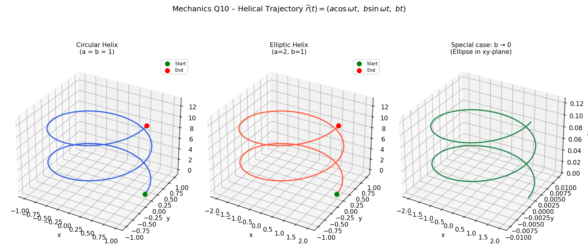

## 10. Kinematics

Point M moves according to the equation:

$$
\vec{r}(t) = (a \cos(\omega t), b \sin(\omega t), bt)
$$

where $a, b, \omega$ are positive constants.

a) Find the equation of the point's trajectory,

> **Problem**
>
> Find the geometric shape traced by the point.

> **Idea**
>
> Use the identity $\cos^2\theta + \sin^2\theta = 1$ to eliminate $t$ from the $x$ and $y$ components. The $z$ component gives a linear rise.

> **Step 1 – Extract trigonometric terms**
>
> $$
> \frac{x}{a} = \cos\omega t, \qquad \frac{y}{b} = \sin\omega t
> $$

> **Step 2 – Apply the Pythagorean identity**
>
> $$
> \left(\frac{x}{a}\right)^2 + \left(\frac{y}{b}\right)^2 = 1
> $$

> **Step 3 – Note the $z$ component**
>
> $$
> z = bt \implies t = \frac{z}{b}
> $$

> **Result**
>
> The trajectory satisfies:
>
> $$
> \frac{x^2}{a^2} + \frac{y^2}{b^2} = 1, \qquad z = b \cdot t
> $$
>
> This is a **helix** wound around an elliptical cross-section. When $a = b$, it becomes a **circular helix**.

---

b) Compute the path length of the point from time $t=0$ to $t=t_0$,

> **Problem**
>
> Compute the arc length along the trajectory.

> **Idea**
>
> Arc length is $\displaystyle s = \int_0^{t_0} |\vec{v}(t)|\, dt$.

> **Step 1 – Differentiate $\vec{r}(t)$**
>
> $$
> \vec{v}(t) = (-a\omega\sin\omega t,\ b\omega\cos\omega t,\ b)
> $$

> **Step 2 – Compute the speed**
>
> $$
> |\vec{v}(t)| = \sqrt{a^2\omega^2\sin^2\omega t + b^2\omega^2\cos^2\omega t + b^2}
> $$

> **Step 3 – Simplify for special case $a = b$**
>
> $$
> |\vec{v}| = \sqrt{a^2\omega^2(\sin^2\omega t + \cos^2\omega t) + b^2} = \sqrt{a^2\omega^2 + b^2}
> $$
>
> This is **constant**, so the speed is uniform.

> **Step 4 – Integrate for arc length (general case)**
>
> $$
> s = \int_0^{t_0} \sqrt{a^2\omega^2\sin^2\omega t + b^2\omega^2\cos^2\omega t + b^2}\, dt
> $$

> **Step 5 – Closed form for $a = b$**
>
> $$
> s = \sqrt{a^2\omega^2 + b^2}\cdot t_0
> $$

> **Result**
>
> For general $a \neq b$ the integral must be evaluated numerically.  
> For the special case $a = b$:
>
> $$
> s = t_0\sqrt{a^2\omega^2 + b^2}
> $$

---

c) Draw the trajectory of this point using Python or interactive HTML. Discuss special cases.

> **Discussion of special cases**
>
> | Condition | Shape |
> |-----------|-------|
> | $a = b$ | Circular helix on a cylinder of radius $a$ |
> | $a \neq b$ | Elliptical helix on an elliptic cylinder |
> | $b \to 0$ | Collapses to an ellipse in the $xy$-plane ($z = 0$) |
> | $a = b$, $\omega \to 0$ | Nearly straight line along $z$-axis |
 
> **Idea**
>
> Plot the 3D helix using matplotlib, and show the special cases $a = b$ (circular helix) and $a \neq b$ (elliptic helix).
>
> 

>  
> 

