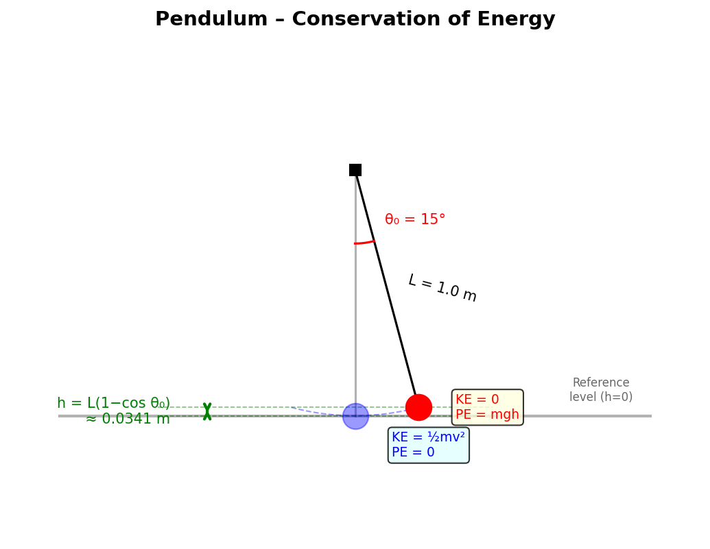

## 3. Conservation of Energy
 
A pendulum with a length of 1.0 meter is released from an initial angle of $15^\circ$. What is the speed of the pendulum bob at the bottom of its swing?
 
> **Problem**
>
> Given $L = 1.0$ m, $\theta_0 = 15°$, released from rest. Find the speed $v$ at the lowest point.
 
> **Idea**
>
> When the pendulum is released from rest at angle $\theta_0$, it has gravitational potential energy but no kinetic energy. At the bottom of the swing, all that potential energy has been converted to kinetic energy (assuming no friction or air resistance). We use the principle of conservation of mechanical energy: $PE_{top} = KE_{bottom}$.
 
> 

>  
> 

 
> **Step 1 – Calculate the height difference**
>
> We need the vertical height $h$ that the bob drops. Looking at the geometry: the bob hangs from a pivot, and at angle $\theta_0$ the vertical distance from pivot to bob is $L\cos\theta_0$ (the adjacent side of the triangle). At the bottom, this distance is $L$. So the height gained above the bottom is:
>
> $$h = L - L\cos\theta_0 = L(1 - \cos\theta_0)$$
>
> Substituting $L = 1.0$ m, $\theta_0 = 15°$:
>
> $$\cos 15° \approx 0.9659$$
>
> $$h = 1.0 \times (1 - 0.9659) = 0.03407 \text{ m} \approx 3.4 \text{ cm}$$
>
> **Physical note:** For such a small angle ($15°$), the height is quite small — only about 3.4 cm. This is expected; the small-angle approximation is often used for pendulums precisely because the vertical displacement is tiny compared to the string length.
 
> **Step 2 – Apply conservation of energy**
>
> Setting the bottom of the swing as our reference level ($h = 0$):
>
> At the top (release point): $E = mgh + 0$ (all potential, released from rest)
>
> At the bottom: $E = 0 + \frac{1}{2}mv^2$ (all kinetic, at reference level)
>
> Equating:
>
> $$mgh = \frac{1}{2}mv^2$$
>
> The mass $m$ cancels — the speed at the bottom is independent of the bob's mass:
>
> $$v = \sqrt{2gh}$$
>
> This is the same formula as for an object falling freely through height $h$, which makes sense: the pendulum bob effectively "falls" through this height, just along a curved path.
 
> **Step 3 – Calculate**
>
> $$v = \sqrt{2 \times 9.81 \times 0.03407} = \sqrt{0.6685}$$
>
> $$v \approx 0.818 \text{ m/s}$$
>
> **Unit check:** $\sqrt{[\text{m/s}^2][\text{m}]} = \sqrt{\text{m}^2/\text{s}^2} = \text{m/s}$ ✓
>
> **Reasonableness:** About 0.8 m/s is a slow walking speed. For a pendulum swinging through only a few centimeters of height, this seems quite reasonable.
 
> **Result**
>
> $$\boxed{v \approx 0.818 \text{ m/s}}$$
 
---
