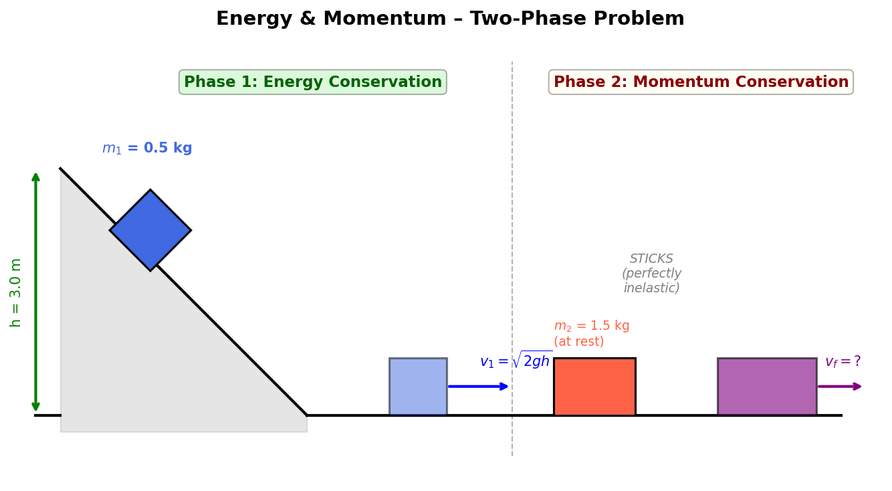

## 4. Energy & Momentum
 
A 0.5 kg block slides down a frictionless track from a height of 3.0 m. At the bottom, it collides and sticks to a 1.5 kg block, which is initially at rest. What is the speed of the combined mass just after the collision?
 
> **Problem**
>
> $m_1 = 0.5$ kg slides from $h = 3.0$ m, collides and sticks to $m_2 = 1.5$ kg at rest. Find $v_f$.
 
> **Idea**
>
> This problem has two distinct phases that must be analyzed separately:
>
> **Phase 1 (sliding down):** The track is frictionless, so mechanical energy is conserved. We use energy conservation to find how fast $m_1$ is moving when it reaches the bottom.
>
> **Phase 2 (collision):** The blocks stick together — this is a perfectly inelastic collision. During the collision, energy is **not** conserved (some is lost to deformation, heat, sound), but momentum **is** always conserved.
>
> We cannot use energy conservation across the entire process because the collision dissipates energy. We must handle each phase with the correct principle.
 
> 

>  
> 

 
> **Step 1 – Speed of $m_1$ at the bottom (Energy Conservation)**
>
> Before the collision, the block slides down frictionlessly:
>
> $$m_1gh = \frac{1}{2}m_1v_1^2 \implies v_1 = \sqrt{2gh}$$
>
> $$v_1 = \sqrt{2 \times 9.81 \times 3.0} = \sqrt{58.86} \approx 7.672 \text{ m/s}$$
>
> So $m_1 = 0.5$ kg arrives at the bottom moving at about 7.67 m/s horizontally.
 
> **Step 2 – Perfectly inelastic collision (Momentum Conservation)**
>
> Just before the collision: $m_1$ moves at $v_1$, and $m_2$ is at rest.
>
> Just after the collision: both blocks move together at unknown speed $v_f$.
>
> Conservation of momentum (no external horizontal forces during the brief collision):
>
> $$m_1 v_1 + m_2 \cdot 0 = (m_1 + m_2)v_f$$
>
> $$v_f = \frac{m_1 v_1}{m_1 + m_2} = \frac{0.5 \times 7.672}{0.5 + 1.5} = \frac{3.836}{2.0}$$
>
> **Physical interpretation:** The final speed is the initial momentum divided by the total mass. Since the total mass (2.0 kg) is 4 times $m_1$ (0.5 kg), the speed drops to 1/4 of the original.
 
> **Step 3 – Calculate**
>
> $$v_f = 1.918 \text{ m/s}$$
>
> **Energy check:** Initial KE = $\frac{1}{2}(0.5)(7.672)^2 \approx 14.7$ J. Final KE = $\frac{1}{2}(2.0)(1.918)^2 \approx 3.68$ J. About 75% of the kinetic energy was lost in the collision, which is typical for a perfectly inelastic collision where $m_2 = 3m_1$.
 
> **Result**
>
> $$\boxed{v_f \approx 1.92 \text{ m/s}}$$
 
---
