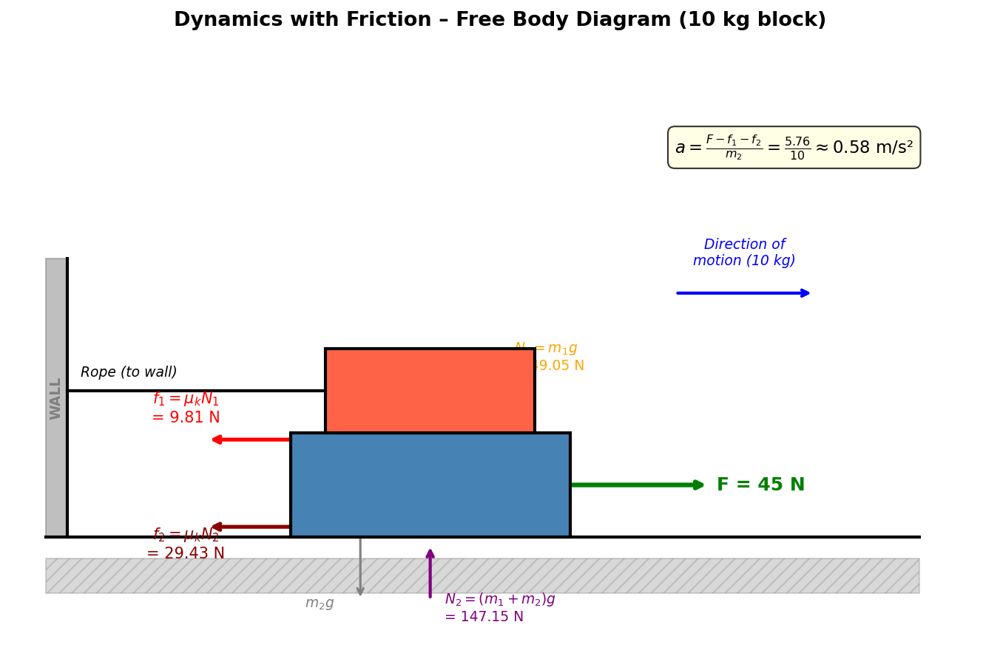

## 7. Dynamics with Friction
 
A 5 kg block is placed on a 10 kg block. A horizontal force of 45 N is applied to the 10 kg block, and the 5 kg block is tied to the wall. The coefficient of kinetic friction between all moving surfaces is 0.2. Find the acceleration of the 10 kg block.
 
> **Problem**
>
> $m_1 = 5$ kg (top, tied to wall), $m_2 = 10$ kg (bottom, pushed), $F = 45$ N, $\mu_k = 0.2$. Find $a$.
 
> **Idea**
>
> The 10 kg block (bottom) sits on the floor, and the 5 kg block (top) sits on top of it, tied to the wall by a rope. When we push the 10 kg block horizontally, it slides out from under the 5 kg block. The 5 kg block stays in place because the wall holds it.
>
> The 10 kg block experiences **three horizontal forces**: the applied force $F = 45$ N forward, friction from the 5 kg block on its top surface (backward), and friction from the floor on its bottom surface (backward).
>
> There are **two separate contact surfaces** with friction:
> - **Top surface:** between the 5 kg block (stationary) and the 10 kg block (moving)
> - **Bottom surface:** between the 10 kg block (moving) and the floor (stationary)
 
> 

>  
> 

 
> **Step 1 – Determine the normal forces**
>
> **Top surface:** The normal force here equals the weight of the 5 kg block (the only thing pressing down on this surface):
>
> $$N_1 = m_1 g = 5 \times 9.81 = 49.05 \text{ N}$$
>
> **Bottom surface:** The floor must support the weight of **both** blocks. Even though the top block is tied to the wall horizontally, it still rests on the bottom block vertically (the rope is horizontal, so it exerts no vertical force):
>
> $$N_2 = (m_1 + m_2)g = (5 + 10) \times 9.81 = 15 \times 9.81 = 147.15 \text{ N}$$
>
> **Key point:** $N_2 \neq m_2 g$. The floor bears the weight of both blocks.
 
> **Step 2 – Calculate the friction forces**
>
> Both surfaces involve kinetic friction (the 10 kg block slides against both). Using $f = \mu_k N$:
>
> Friction on the top surface (the 5 kg block rubbing against the top of the 10 kg block):
>
> $$f_1 = \mu_k N_1 = 0.2 \times 49.05 = 9.81 \text{ N}$$
>
> Friction on the bottom surface (the floor rubbing against the bottom of the 10 kg block):
>
> $$f_2 = \mu_k N_2 = 0.2 \times 147.15 = 29.43 \text{ N}$$
>
> Both friction forces act **backward** (opposing the motion of the 10 kg block).
 
> **Step 3 – Apply Newton's 2nd law to the 10 kg block**
>
> Taking the forward direction as positive, the net force on the 10 kg block is:
>
> $$F_{net} = F - f_1 - f_2 = 45 - 9.81 - 29.43 = 5.76 \text{ N}$$
>
> The applied force (45 N) barely overcomes the total friction (39.24 N), leaving only 5.76 N of net force.
 
> **Step 4 – Calculate the acceleration**
>
> By Newton's 2nd law, $F_{net} = m_2 \cdot a$ (only the 10 kg block accelerates; the 5 kg block is held stationary by the wall):
>
> $$a = \frac{F_{net}}{m_2} = \frac{5.76}{10} = 0.576 \text{ m/s}^2$$
>
> Using $g = 9.8$ m/s² (rounded): $f_1 = 9.8$ N, $f_2 = 29.4$ N, $F_{net} = 5.8$ N, $a = 0.58$ m/s².
>
> **Physical check:** The acceleration is quite small (~0.58 m/s²) because nearly all of the applied 45 N is consumed by friction. Without friction: $a = 45/10 = 4.5$ m/s², so friction reduces it by roughly 87%.
 
> **Result**
>
> $$\boxed{a \approx 0.58 \text{ m/s}^2}$$
 
---
