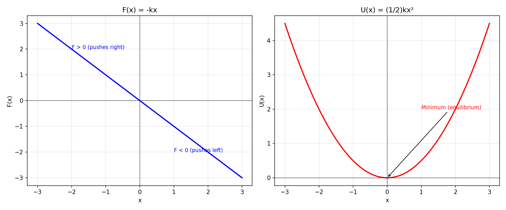

## 8. Work of a variable force
 
Given a one-dimensional force:
 
$$
F(x)=-kx
$$
 
* Write down the equation of motion and solve it.
* Calculate the work done during the displacement from $0$ to $x_0$.
* Interpret the result as potential energy.
* Verify the relationship $F = -\frac{dU}{dx}$.
* Draw the graph of $F(x)$ and $U(x)$.
 
### (a) Equation of Motion and Solution
 
> **Step 1 – Write Newton's 2nd law**
>
> The force $F(x) = -kx$ is Hooke's law — the restoring force of an ideal spring. The negative sign means the force always points toward the origin (equilibrium): if $x > 0$, the force is negative (pulls back); if $x < 0$, the force is positive (pushes forward).
>
> Applying $F = ma$:
>
> $$ma = -kx \implies m\ddot{x} = -kx$$
>
> Rearranging into standard form:
>
> $$\ddot{x} + \frac{k}{m}x = 0$$
 
> **Step 2 – Define $\omega^2 = k/m$ and identify the equation**
>
> $$\ddot{x} + \omega^2 x = 0$$
>
> This is the **simple harmonic oscillator** equation. The characteristic equation is $r^2 + \omega^2 = 0$, giving complex roots $r = \pm i\omega$, which means the solution involves sines and cosines (oscillation, not exponential growth/decay).
 
> **Step 3 – Write the general solution**
>
> $$x(t) = A\cos(\omega t + \phi)$$
>
> where:
> - $A$ = amplitude (maximum displacement), determined by initial conditions
> - $\phi$ = phase angle, determined by initial conditions
> - $\omega = \sqrt{k/m}$ = angular frequency
>
> **Physical meaning:** The mass oscillates back and forth about $x = 0$ forever (in absence of friction). The period is $T = 2\pi/\omega = 2\pi\sqrt{m/k}$.
 
### (b) Work Done
 
> **Step 4 – Write the work integral**
>
> The work done by a variable force during a displacement from $x = 0$ to $x = x_0$ is:
>
> $$W = \int_0^{x_0} F(x)\,dx = \int_0^{x_0} (-kx)\,dx$$
>
> We cannot simply use $W = Fd$ because the force changes with position. The integral sums up the infinitesimal work $dW = F\,dx$ over the entire path.
 
> **Step 5 – Evaluate the integral**
>
> $$W = -k\int_0^{x_0} x\,dx = -k\left[\frac{x^2}{2}\right]_0^{x_0} = -k\left(\frac{x_0^2}{2} - 0\right) = -\frac{1}{2}kx_0^2$$
>
> **Sign interpretation:** The work is negative. This means the spring force opposes the displacement. When you stretch a spring from 0 to $x_0$, the spring force does negative work (it resists being stretched).
 
> **Result**
>
> $$\boxed{W = -\frac{1}{2}kx_0^2}$$
 
### (c) Potential Energy Interpretation
 
> **Step 6 – Relate work to potential energy**
>
> For a conservative force, we define potential energy through:
>
> $$W_{conservative} = -\Delta U = -(U_{final} - U_{initial})$$
>
> The negative sign means: when the force does negative work (opposes motion), potential energy **increases** — energy is being stored.
>
> Applying this with $U(0) = 0$ as our reference:
>
> $$-\frac{1}{2}kx_0^2 = -(U(x_0) - 0) \implies U(x_0) = \frac{1}{2}kx_0^2$$
>
> Since $x_0$ is arbitrary:
>
> $$\boxed{U(x) = \frac{1}{2}kx^2}$$
>
> **Physical meaning:** This is elastic potential energy. It is always non-negative, minimum at $x = 0$ (equilibrium), and grows quadratically with displacement.
 
### (d) Verification: $F = -dU/dx$
 
> **Step 7 – Differentiate and compare**
>
> $$\frac{dU}{dx} = \frac{d}{dx}\left(\frac{1}{2}kx^2\right) = kx$$
>
> $$F = -\frac{dU}{dx} = -kx \quad \checkmark$$
>
> The force always points "downhill" on the potential energy curve — toward lower $U$.
 
### (e) Graphs
 
> **Step 8 – Plot $F(x)$ and $U(x)$**
>
> $F(x) = -kx$ is a straight line through the origin with negative slope. It's an odd function: $F(-x) = -F(x)$.
>
> $U(x) = \frac{1}{2}kx^2$ is an upward-opening parabola with minimum at the origin. It's an even function: $U(-x) = U(x)$.
>
> The force is the negative derivative of $U$, so where $U$ has its steepest positive slope (large positive $x$), $F$ is most negative, and vice versa. At the minimum of $U$ ($x = 0$), the force is zero.
 
> 

>  
> 

