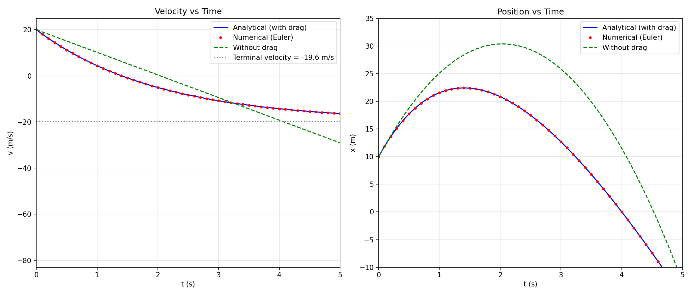

# 9. Vertical throw with drag
 
We have the equation of motion:
 
$$
m\frac{dv}{dt} = -mg - kv
$$
 
with initial conditions $v(0)=v_0$, $x(0)=10$.
 
* Solve the equation by analytical methods.
* Determine the maximum height.
* Compare with the case without drag.
* Perform a numerical simulation using HTML or Pythyon.
 
> **Physical setup:** An object is thrown vertically upward with initial velocity $v_0$ from height $x = 10$ m. Two forces act on it: gravity ($-mg$, always downward) and air drag ($-kv$, opposing velocity — downward while the object moves up). Both forces decelerate the object, so it stops sooner and at a lower height than without drag.
 
## (a) Analytical Solution
 
> **Step 1 – Rearrange the equation**
>
> $$m\frac{dv}{dt} = -mg - kv$$
>
> Divide both sides by $m$:
>
> $$\frac{dv}{dt} = -g - \frac{k}{m}v$$
>
> Introduce $\gamma = k/m$ (units: 1/s, the inverse of the relaxation time):
>
> $$\frac{dv}{dt} = -g - \gamma v$$
>
> This is a first-order linear ODE. The term $-\gamma v$ means the deceleration increases with speed.
 
> **Step 2 – Separate variables**
>
> Rearrange so that $v$-terms are on one side and $t$-terms on the other:
>
> $$\frac{dv}{g + \gamma v} = -dt$$
 
> **Step 3 – Integrate both sides**
>
> Left side uses substitution $u = g + \gamma v$, $du = \gamma\,dv$:
>
> $$\frac{1}{\gamma}\int \frac{du}{u} = \frac{1}{\gamma}\ln|u| = \frac{1}{\gamma}\ln|g + \gamma v|$$
>
> Right side:
>
> $$-\int dt = -t$$
>
> Combining:
>
> $$\frac{1}{\gamma}\ln|g + \gamma v| = -t + C$$
 
> **Step 4 – Apply the initial condition: $v(0) = v_0$**
>
> At $t = 0$:
>
> $$C = \frac{1}{\gamma}\ln|g + \gamma v_0|$$
>
> Subtracting to eliminate $C$:
>
> $$\frac{1}{\gamma}\ln\left|\frac{g + \gamma v}{g + \gamma v_0}\right| = -t$$
>
> Exponentiating:
>
> $$\frac{g + \gamma v}{g + \gamma v_0} = e^{-\gamma t}$$
 
> **Step 5 – Solve for $v(t)$**
>
> $$g + \gamma v = (g + \gamma v_0)e^{-\gamma t}$$
>
> $$\gamma v = (g + \gamma v_0)e^{-\gamma t} - g$$
>
> $$\boxed{v(t) = \left(v_0 + \frac{g}{\gamma}\right)e^{-\gamma t} - \frac{g}{\gamma}}$$
>
> or with $\gamma = k/m$:
>
> $$v(t) = \left(v_0 + \frac{mg}{k}\right)e^{-kt/m} - \frac{mg}{k}$$
>
> **Physical analysis:**
> - At $t = 0$: $v(0) = (v_0 + g/\gamma) \cdot 1 - g/\gamma = v_0$ ✓
> - As $t \to \infty$: the exponential vanishes, giving $v \to -g/\gamma = -mg/k$. This is the **terminal velocity**.
> - The velocity decreases exponentially from $v_0$ toward $-g/\gamma$, crossing zero at $t^*$ (the peak).
 
> **Step 6 – Find position by integrating**
>
> $$x(t) = x(0) + \int_0^t v(\tau)\,d\tau$$
>
> $$x(t) = 10 + \int_0^t \left[\left(v_0 + \frac{g}{\gamma}\right)e^{-\gamma \tau} - \frac{g}{\gamma}\right]d\tau$$
>
> Evaluating term by term:
>
> $$\int_0^t \left(v_0 + \frac{g}{\gamma}\right)e^{-\gamma \tau}\,d\tau = -\frac{1}{\gamma}\left(v_0 + \frac{g}{\gamma}\right)\left(e^{-\gamma t} - 1\right)$$
>
> $$\int_0^t \left(-\frac{g}{\gamma}\right)d\tau = -\frac{g}{\gamma}t$$
>
> Combining:
>
> $$\boxed{x(t) = \frac{1}{\gamma}\left(v_0 + \frac{g}{\gamma}\right)\left(1 - e^{-\gamma t}\right) - \frac{g}{\gamma}t + 10}$$
 
## (b) Maximum Height
 
> **Step 7 – Solve $v(t^*) = 0$ to find the time of maximum height**
>
> $$\left(v_0 + \frac{g}{\gamma}\right)e^{-\gamma t^*} = \frac{g}{\gamma}$$
>
> $$e^{-\gamma t^*} = \frac{g}{g + \gamma v_0}$$
>
> $$t^* = \frac{1}{\gamma}\ln\left(1 + \frac{\gamma v_0}{g}\right)$$
 
> **Step 8 – Calculate $x(t^*)$**
>
> Substituting $e^{-\gamma t^*} = \frac{g}{g + \gamma v_0}$ into $x(t)$:
>
> $$x_{max} = \frac{1}{\gamma}\left(v_0 + \frac{g}{\gamma}\right)\left(1 - \frac{g}{g + \gamma v_0}\right) - \frac{g}{\gamma}t^* + 10$$
>
> Simplify the bracket:
>
> $$1 - \frac{g}{g + \gamma v_0} = \frac{\gamma v_0}{g + \gamma v_0}$$
>
> First term becomes:
>
> $$\frac{1}{\gamma} \cdot \frac{g + \gamma v_0}{\gamma} \cdot \frac{\gamma v_0}{g + \gamma v_0} = \frac{v_0}{\gamma}$$
>
> So:
>
> $$\boxed{x_{max} = 10 + \frac{v_0}{\gamma} - \frac{g}{\gamma^2}\ln\left(1 + \frac{\gamma v_0}{g}\right)}$$
 
## (c) Comparison with the No-Drag Case
 
> **Step 9 – Solve without drag ($k = 0$)**
>
> Without drag:
>
> $$v(t) = v_0 - gt, \qquad t^*_{no\,drag} = \frac{v_0}{g}$$
>
> $$x_{max,\,no\,drag} = 10 + \frac{v_0^2}{2g}$$
>
> With drag, the object rises for a shorter time and reaches a lower maximum height.
 
> **Step 10 – Verify the limit $\gamma \to 0$**
>
> Using $\ln(1+u) \approx u - u^2/2$ for small $u = \gamma v_0 / g$:
>
> $$\frac{g}{\gamma^2}\ln\left(1 + \frac{\gamma v_0}{g}\right) \approx \frac{g}{\gamma^2}\left(\frac{\gamma v_0}{g} - \frac{\gamma^2 v_0^2}{2g^2}\right) = \frac{v_0}{\gamma} - \frac{v_0^2}{2g}$$
>
> Therefore:
>
> $$x_{max} \approx 10 + \frac{v_0}{\gamma} - \left(\frac{v_0}{\gamma} - \frac{v_0^2}{2g}\right) = 10 + \frac{v_0^2}{2g} \quad \checkmark$$
 
## (d) Numerical Simulation
 
> 

>  
> 

