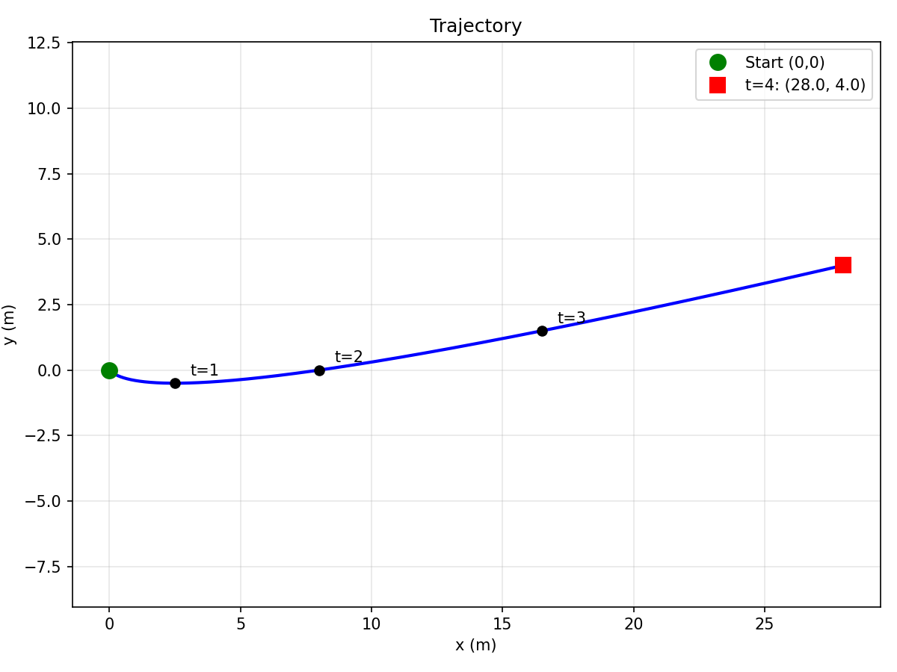

# 12. Work and energy with a constant force

A constant force acts on a body of mass $m = 2\ \mathrm{kg}$:

$$
\vec F = [6, 2]\ \mathrm{N}
$$

The body starts with an initial velocity $\vec v(0) = (1, -1)\ \mathrm{\frac{m}{s}}$ from the point $\vec r(0)=(0,0)\ \mathrm{m}$. 
* Determine $\vec a(t)$.
* Determine $\vec v(t)$.
* Determine $\vec r(t)$.
* Draw the trajectory of the motion.
* Calculate the work done by the force at time $t=3\ \mathrm{s}$.
* Check the consistency with the work-energy theorem.

> **Idea**
>
> With a constant force, the acceleration is also constant — same type of motion as projectile motion. The kinematic equations for constant acceleration apply directly, and since the force is constant, the work is simply $W = \vec{F} \cdot \Delta\vec{r}$.

---

## (a) Determine $\vec{a}(t)$

> **Step 1 – Apply Newton's 2nd law**
>
> $$\vec{a} = \frac{\vec{F}}{m} = \frac{(6, 2)}{2} = (3, 1) \text{ m/s}^2$$
>
> Constant acceleration — does not depend on time, position, or velocity. The angle with the $x$-axis is $\theta_a = \arctan(1/3) \approx 18.4°$.
>
> $$\boxed{\vec{a}(t) = (3, 1) \text{ m/s}^2}$$

---

## (b) Determine $\vec{v}(t)$

> **Step 2 – Use $\vec{v}(t) = \vec{v}_0 + \vec{a}t$**
>
> $$v_x(t) = 1 + 3t \qquad (\text{starts at 1 m/s, increases by 3 m/s each second})$$
>
> $$v_y(t) = -1 + t \qquad (\text{starts at } -1 \text{ m/s, crosses zero at } t = 1 \text{ s})$$
>
> $$\boxed{\vec{v}(t) = (1 + 3t,\ -1 + t) \text{ m/s}}$$
>
> **Note:** Before $t = 1$ s the particle moves downward ($v_y < 0$); after $t = 1$ s it moves upward. This creates a curved trajectory with a minimum $y$-value at $t = 1$ s.

---

## (c) Determine $\vec{r}(t)$

> **Step 3 – Use $\vec{r}(t) = \vec{r}_0 + \vec{v}_0 t + \frac{1}{2}\vec{a}t^2$**
>
> $$x(t) = 0 + 1 \cdot t + \frac{1}{2}(3)t^2 = t + \frac{3}{2}t^2$$
>
> $$y(t) = 0 + (-1) \cdot t + \frac{1}{2}(1)t^2 = -t + \frac{1}{2}t^2$$
>
> $$\boxed{\vec{r}(t) = \left(t + \frac{3}{2}t^2,\ \ -t + \frac{1}{2}t^2\right) \text{ m}}$$
>
> **Key positions:**
> - $t = 0$: $(0, 0)$ — origin
> - $t = 1$: $(2.5, -0.5)$ — lowest point of trajectory
> - $t = 2$: $(8, 0)$ — back to $y = 0$
> - $t = 3$: $(16.5, 1.5)$

---

## (d) Draw the trajectory

> **Step 4 – Parametric trajectory**
>
> The trajectory dips below the $x$-axis (minimum at $t = 1$ s where $y_{min} = -0.5$ m), then curves upward. The particle accelerates to the right throughout.

> 

>  
> 

---

## (e) Calculate the work done at $t = 3$ s

> **Step 5 – Compute work using $W = \vec{F} \cdot \Delta\vec{r}$**
>
> For a constant force, the work is the dot product of force with total displacement:
>
> $$W = \vec{F} \cdot [\vec{r}(3) - \vec{r}(0)] = \vec{F} \cdot \vec{r}(3)$$
>
> Position at $t = 3$ s:
>
> $$x(3) = 3 + \frac{3}{2}(9) = 3 + 13.5 = 16.5 \text{ m}$$
>
> $$y(3) = -3 + \frac{1}{2}(9) = -3 + 4.5 = 1.5 \text{ m}$$
>
> $$\vec{r}(3) = (16.5,\ 1.5) \text{ m}$$
>
> Work (dot product):
>
> $$W = F_x \cdot x(3) + F_y \cdot y(3) = 6 \times 16.5 + 2 \times 1.5 = 99 + 3 = 102 \text{ J}$$
>
> $$\boxed{W = 102 \text{ J}}$$

---

## (f) Check the consistency with the work-energy theorem

> **Step 6 – Compute initial kinetic energy**
>
> $$KE_i = \frac{1}{2}m|\vec{v}_0|^2 = \frac{1}{2}(2)(1^2 + (-1)^2) = \frac{1}{2}(2)(2) = 2 \text{ J}$$

> **Step 7 – Compute final kinetic energy at $t = 3$ s**
>
> $$\vec{v}(3) = (1 + 9,\ -1 + 3) = (10,\ 2) \text{ m/s}$$
>
> $$|\vec{v}(3)|^2 = 10^2 + 2^2 = 104 \text{ m}^2/\text{s}^2$$
>
> $$KE_f = \frac{1}{2}(2)(104) = 104 \text{ J}$$
>
> The particle went from 2 J to 104 J — a dramatic increase. The force continuously does positive work, transferring energy to the particle.

> **Step 8 – Verify the work-energy theorem**
>
> The work-energy theorem states: $W_{net} = \Delta KE = KE_f - KE_i$
>
> $$\Delta KE = 104 - 2 = 102 \text{ J}$$
>
> $$W = 102 \text{ J} = \Delta KE = 102 \text{ J} \quad \checkmark$$
>
> The theorem is satisfied exactly. Since $\vec{F}$ is the only force, the work done by $\vec{F}$ is the net work.

> **Result**
>
> The work-energy theorem is verified: $W = \Delta KE = 102$ J $\checkmark$
